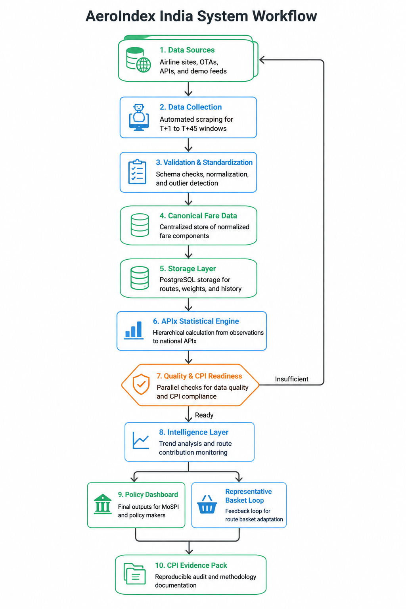

# AeroIndex India Intelligence Module

This standalone Python package implements the SIH26056 intelligence/statistical prototype. It supports demo CSV input and a persistence-backed collection pipeline without a framework dependency.

## Methodology

For each route, booking window, and period, the representative fare is the **median** of valid positive fares. Invalid, missing, zero, and negative fares are excluded from that group. A price relative is:

`100 * current representative fare / base representative fare`

Each comparable route/cell elementary index uses a Jevons index (geometric mean):

`100 * geometric_mean(current fare / base fare)`

The overall Airfare Price Index is the weighted arithmetic aggregation of those elementary indices using authoritative route/cell weights. Booking windows are collection and comparability parameters only; they are never assigned invented statistical weights. The base comparison is 100.

Route weights are external configuration and must carry metadata identifying their source and status (`official`, `configured`, or `demonstration`). The official CPI 2024 Airfare item weight is stored separately as the CPI item weight; it is not silently converted into route or booking-window weights.

Confidence is a deterministic 0-100 score:

`0.25*S + 0.20*R + 0.15*W + 0.15*F + 0.10*D + 0.10*O + 0.05*H`

The components are source coverage, route coverage, booking-window coverage, field completeness, duplicate quality, outlier stability, and schema stability. Outlier stability uses the transparent IQR rule; high fares are not deleted merely because they are high.

Insights are structured dictionaries generated from calculated index movement and contribution results. No LLM or fabricated explanation is used.

## Demo assumptions

`data/demo_weights.csv` contains prototype/demo assumptions, not official SIH weights. The file is loaded at runtime, validated, and can be replaced by team-approved weights. The demo contains one source per route family and base/current periods.

## Flowchart



## System Architecture

AeroIndex India follows a modular architecture that collects airfare data, processes and validates it, calculates the Airfare Price Index (APIx), and presents the results through a policy-focused dashboard.


                    ┌──────────────────────────┐
                    │     AIRLINE / OTA        │
                    │     DATA SOURCES         │
                    └────────────┬─────────────┘
                                 │
                                 ▼
                    ┌──────────────────────────┐
                    │    DATA COLLECTION       │
                    │  Source Adapters         │
                    │  T+1 ... T+45 Windows    │
                    └────────────┬─────────────┘
                                 │
                                 ▼
                    ┌──────────────────────────┐
                    │ VALIDATION & STANDARDIZE │
                    │ Cleaning • Duplicates    │
                    │ Outliers • Normalization │
                    └────────────┬─────────────┘
                                 │
                                 ▼
                    ┌──────────────────────────┐
                    │     POSTGRESQL DB        │
                    │ Routes • Fares • Weights │
                    │ Sources • History        │
                    └────────────┬─────────────┘
                                 │
                                 ▼
                    ┌──────────────────────────┐
                    │   APIx & INTELLIGENCE    │
                    │ Index Calculation        │
                    │ Route Analytics           │
                    │ Confidence & CPI Checks  │
                    └────────────┬─────────────┘
                                 │
                                 ▼
                    ┌──────────────────────────┐
                    │      FASTAPI BACKEND     │
                    │       REST APIs          │
                    └────────────┬─────────────┘
                                 │
                                 │ JSON / REST
                                 ▼
                    ┌──────────────────────────┐
                    │    REACT FRONTEND        │
                    │  Dashboard & Analytics   │
                    └────────────┬─────────────┘
                                 │
                                 ▼
              ┌────────────────────────────────────┐
              │          POLICY OUTPUTS             │
              │                                    │
              │  • National APIx                   │
              │  • Route Analytics                 │
              │  • Booking Window Intelligence     │
              │  • Confidence / CPI Readiness      │
              │  • CPI Evidence Pack               │
              └────────────────────────────────────┘

## Run

From the project root:

```powershell
python run_live.py
```

Run tests with:

```powershell
python -m pytest -q
```

## Integration

`IntelligenceRepository` stores collected observations and weights in a source SQLite database. `collect_and_calculate(source_repository, result_repository, collectors)` then reads from the source database, calculates the Jevons APIx, and stores the JSON report in a separate result SQLite database. Airline collectors implement the `FareCollector` protocol and return normalized `Observation` objects, so scraping remains outside the statistical core.

The runtime flow is:

`airline collector -> clean_observations -> source database -> APIx calculation -> result database`

The cleaning stage trims and normalizes text, uppercases route and fare-class codes, rejects missing structural fields and non-positive booking windows, and removes duplicate observation IDs. Invalid fares remain represented as missing values so the quality score can account for them.

Raw collection records are stored in `raw_observations`; normalized records are stored in `observations`. Validation failures are stored in `validation_issues`. Result JSON stores elementary indices, route weights, weight provenance, calculation status, methodology, and weighting status.

The repository does not yet include production IndiGo or Air India collectors. Those sites can change their markup and may require a browser flow, CAPTCHA handling, or permission from the airline. Before enabling live collection, configure the approved route/date search inputs and implement a collector using the airline's permitted interface, then pass both repositories to `collect_and_calculate`.

Playwright collectors are provided in `intelligence/airline_collectors.py`. A smoke test can be run from Python after inspecting the current fare-result selector:

```python
from intelligence.airline_collectors import AirIndiaCollector, IndigoCollector
from intelligence.pipeline import collect_and_calculate
from intelligence.storage import IntelligenceRepository

source = IntelligenceRepository("data/source.db")
results = IntelligenceRepository("data/results.db")
collectors = [
	AirIndiaCollector("DEL", "BOM", "2026-09-15", "current", 15, "<verified-fare-selector>"),
	IndigoCollector("DEL", "BOM", "2026-09-15", "current", 15, "<verified-fare-selector>"),
]
report = collect_and_calculate(source, results, collectors)
```

Do not bypass CAPTCHA, login, or anti-bot controls. The collector raises an error when a block page is detected.

For a command-line run against Skyscanner, EaseMyTrip, or both airline collectors and all booking windows, use `run_live.py`. The weights file must contain the approved route and window weights:

```powershell
python run_live.py --source skyscanner --travel-date 2026-09-15 --windows 15 --weights data/demo_weights.csv --cpi-airfare-file data/cpi_weights.csv --cpi-sector Rural
```

The current observed Skyscanner fare-text selector is `[data-backpack-ds-component="Text"]`; pass `--skyscanner-fare-selector` if the rendered site changes.

The observed EaseMyTrip listing fare selector is `.value`; pass `--easemytrip-fare-selector` if the rendered site changes. EaseMyTrip airline/cabin/stops fields remain null unless the listing exposes them.

If Skyscanner presents a CAPTCHA, run with `--headed`. The browser will remain open, wait for you to complete the verification manually, and continue after you press Enter in the terminal. Headless mode stops instead of bypassing the verification.

Run once with `--period base` and once with `--period current` to populate both comparison periods.

The command above uses `data/demo_weights.csv` and therefore produces `DEMONSTRATION-WEIGHTED` output. It is suitable only for testing. Production execution must provide an authoritative route-weight CSV with route metadata marked `official`; otherwise the calculation is blocked with `ROUTE_WEIGHTS_MISSING`.

Example observed Skyscanner source values from a permitted `DEL -> BOM` search included `₹4,999`, `₹5,217`, and `₹6,580`. These are stored as raw fare text and normalized as `4999`, `5217`, and `6580` INR. For a matched base/current pair of ₹5,000 and ₹5,500, the elementary Jevons index is `110.0`; the final index is then the authoritative route-weighted aggregation of route elementary indices.